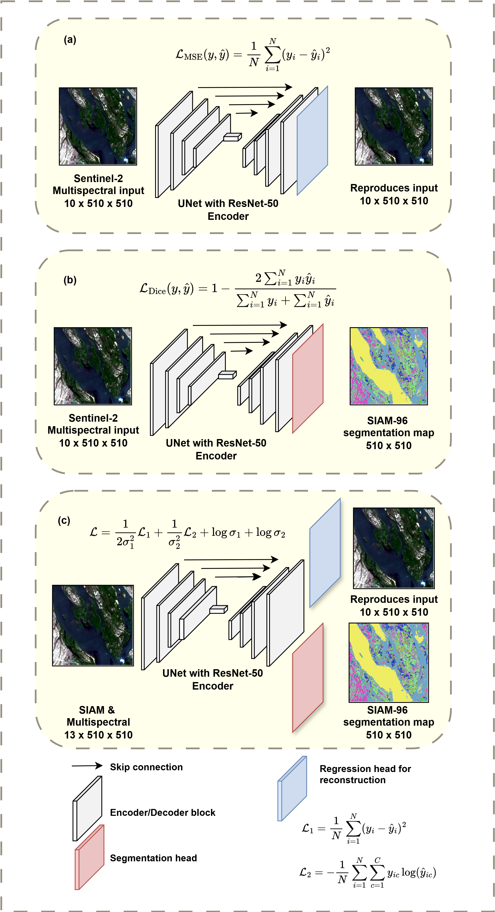

# Knowledge-based semantic enrichments for semantic image segmentation

### Abstract
The incorporation of prior knowledge into deep learning models is expanding across various fields. In remote sensing, this often involves using spectral indices and incorporating physical principles into the models’ loss functions. Yet, the approach of embedding domain-specific semantic information—detailed descriptions at the pixel level in satellite images—in deep learning settings has not been explored. This study seeks to establish foundational benchmarks for integrating such semantically enriched data, investigating three different approaches. Additionally, the study examines the potential of using semantically enriched data in the pretraining phase, which is particularly beneficial when labelled data is scarce. The findings indicate that the most detailed semantic data achieves the best performance in a fully supervised learning setup. Furthermore, models combining semantic and multispectral data as inputs surpass all others in supervised and pretraining settings. However, due to design limitations, such as the minimal use of unlabeled data for pretraining, the benefits of integrating semantic data in pretraining tasks are not definitively proven. This is among the initial studies in this area, so employing simple network architectures and training strategies was necessary. Considering the ongoing advancements in self and semi-supervised learning, future research is encouraged to utilise more sophisticated pretraining approaches. 

Keywords: semantic enrichment, semantic segmentation,pretraining, multi-task learning

**For further details, please refer to the [paper](https://rajesvariparasa.github.io/assets/docs/Parasa_Thesis_v2.pdf).**

### Methods

A)  Illustration of the different training scenarios for models trained from scratch employed by this study

B)  Illustration of the different training scenarios for pretraining tasks employed by this study

### Results

A) Model performance as a function of the proportion of labelled samples

B) Model performance vs training convergence (tradeoff)

C) Classwise model performance

# Implementation
The implementation pretraining experiments need a reconstruction head implemented in this version of SMP library: 
[SMP ReconstructionHead](https://github.com/rajesvariparasa/segmentation_models.pytorch_reconstructionhead)

Install using command:
`pip install -e git+git://github.com/wdonahoe/rajesvariparasa/segmentation_models.pytorch_reconstructionhead.git`

